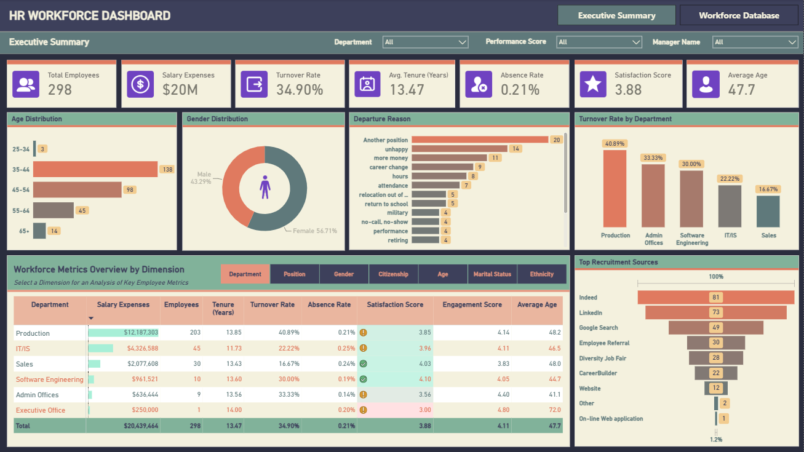
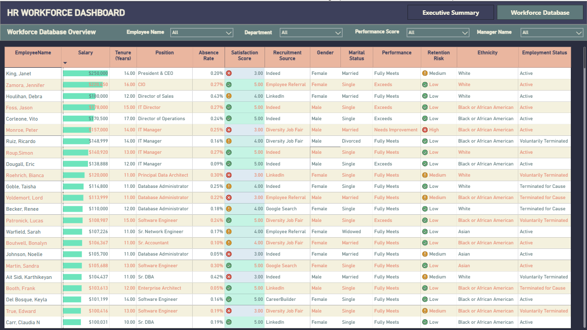

# HR Workforce Analytics Dashboard — Power BI

A two-page Power BI report covering headcount, turnover, salary cost and employee engagement for a 298-person organisation, built from six related Excel sheets cleaned entirely in Power Query.

| | |
|---|---|
| **Tools** | Power BI Desktop, Power Query (M), DAX |
| **Source** | `HRDataset.xlsx` — 298 employees across 6 sheets |
| **Model** | Star schema with one snowflake branch, 8 tables |
| **Pages** | Executive Summary, Workforce Database |
| **File** | [`HR_Dashboard.pbix`](HR_Dashboard.pbix) |

> **Scope note.** This was my first Power BI project. The visual layout follows a reference dashboard design I used as a learning target. The data cleaning, data model, DAX measures and the analysis below are my own work.

---

## Key takeaways

- **One in three employees has left.** Overall turnover is 34.90%, and Production carries it at 40.89% — 203 of 298 staff work there, so the company-wide figure is essentially Production's figure.
- **Recruitment channel predicts retention better than anything else.** Google Search hires leave at 61.2%, Employee Referral hires at 16.7% — a 45-point gap between channels of comparable size.
- **Turnover is not concentrated in poor performers.** "Fully Meets" covers 233 people and loses 82 of them — eight times the losses from "Needs Improvement".
- **Most exits are voluntary and avoidable.** Another position, unhappy, more money and career change account for 54 of 104 terminations. Only 4 exits cite performance.

---

## Table of contents

1. [Objective](#1-objective)
2. [Dataset](#2-dataset)
3. [Data preparation in Power Query](#3-data-preparation-in-power-query)
4. [Data model](#4-data-model)
5. [Dashboard](#5-dashboard)
6. [Insights](#6-insights)
7. [Recommendations](#7-recommendations)
8. [What I learned](#8-what-i-learned)

---

## 1. Objective

HR data in this organisation lived in six disconnected Excel sheets, joined only by ID columns and full of formatting inconsistencies. Nobody could answer basic questions — how many people work here, what does turnover look like by department, which hiring channels produce people who stay — without rebuilding the spreadsheet by hand each time.

The report answers four questions:

- What is current headcount, salary cost and turnover, and how do they differ by department?
- Which recruitment sources produce employees who stay?
- Is turnover concentrated in any demographic or performance band?
- Why are people leaving?

---

## 2. Dataset

| Sheet | Rows | Role | Key fields |
|---|---|---|---|
| `Employee` | 298 | Employee records | Employee, ManagerID, PositionID, MaritalStatusID, PerformanceScoreID, Location, Birthday, Gender, CitizenDesc, RaceDesc, DateofHire, RecruitmentSource, EmploymentStatus, Termination, DateofTermination, TerminationReason, Salary, EngagementScore, SatisfactionScore, AbsenceDays |
| `Position` | 30 | Job titles | PositionID, Position, DeptID |
| `Department` | 6 | Departments | DeptID, Department |
| `Manager` | 23 | Managers | ManagerID, ManagerName |
| `MaritalStatus` | 5 | Marital status | MaritalStatusID, MaritalDesc |
| `Performance` | 4 | Performance bands | PerfScoreID, PerformanceScore |

---

## 3. Data preparation in Power Query

All cleaning was done in Power Query. No SQL or Python was used. The source is a working HR spreadsheet rather than an export, and it carries the problems that come with one.

### 3.1 Title rows above the real headers

Every sheet begins with one or two title rows (`EMPLOYEE DATA`, `Data as of Jan 2025`, `Position info`). Loaded as-is, Power BI treats these as data and names every column `Column1`, `Column2`, …

**Fix:** Remove Top Rows, then Use First Row as Headers, per sheet.

### 3.2 Employee ID concatenated into the name

All 298 names arrive as `10026-Adinolfi, Wilson  K` — the employee ID prefixed to the name with a hyphen. Left alone, every name is unique-looking text with no usable ID, and no employee-level lookup is possible.

**Fix:** Split Column by Delimiter on the first `-` only, producing a clean `EmployeeID` and `EmployeeName`.

### 3.3 Whitespace in four different places

Whitespace was the single largest source of problems in this dataset:

| Column | Problem | Rows affected |
|---|---|---|
| `Employee` | Trailing spaces | 70 |
| `Employee` | Double spaces inside the name | 16 |
| `Gender` | `"M "` with a trailing space | 129 |
| `Department` (lookup) | `"Production       "` with seven trailing spaces | 1 |

The `Gender` case is the one that breaks a visual: `"M "` and `"M"` are different values, so a two-category field renders as three slices. The `Department` case is more dangerous despite affecting one row — that single lookup value maps to 203 employees, so a mismatched join or a split category would misstate the largest department in the company.

**Fix:** Transform → Format → Trim on every text column for the leading and trailing cases, and Replace Values to collapse the internal double spaces, which Trim does not touch. Gender was then mapped `M` → `Male`, `F` → `Female` for readability in the visuals.

This is where I learned to trim every text column by default rather than waiting for a visual to look wrong.

### 3.4 All three date columns mixed text with datetime

| Column | Stored as text | Stored as datetime |
|---|---|---|
| `Birthday` | 163 | 135 |
| `DateofHire` | 138 | 160 |
| `DateofTermination` | 58 | 46 (plus 194 blank) |

A plain Change Type converts the datetime rows and throws errors on the text rows. Power Query reports this as scattered `Error` cells rather than a failed refresh, so it is easy to miss — and every tenure and age calculation depends on these three columns.

**Fix:** Change Type With Locale set to English (United States) so `MM/DD/YY` values parse correctly, then Change Type to Date. I verified the result by checking that no birth year or hire year fell outside a plausible range.

### 3.5 Nulls that are correct

194 rows have blank `DateofTermination` and `TerminationReason`. These are not errors — they are employees who still work here. Replacing them with zero or "Unknown" would have inflated every termination-based count.

**Fix:** Left blank, and every turnover measure filters on the `Termination` flag rather than counting non-blank termination dates.

### 3.6 Derived columns

| Column | Purpose |
|---|---|
| `Tenure (Years)` | Years between hire date and termination date, or today for active employees |
| `Age Category` | Age bucketed into 25–34, 35–44, 45–54, 55–64, 65+ |
| `Retention Risk` | Low / Medium / High flag, calculated in DAX — see [below](#retention-risk) |

---

## 4. Data model

The cleaned tables form a star schema with one snowflake branch: `Department` is reached through `Position` rather than joined directly to the employee table.

```
Employee ──> Position ──> Department
   ├──> Manager
   ├──> Performance
   └──> MaritalStatus
```

Two additional tables hold no source data:

- **`Measure`** — a measure-only table, so that all DAX sits in one place in the field list rather than being scattered across the fact table.
- **`Dimension`** — a **field parameter** with seven options (Department, Position, Gender, Citizenship, Age, Marital Status, Ethnicity). This drives the button row above the matrix on page 1: one parameter switches the breakdown axis, replacing what would otherwise be seven near-identical matrix visuals.

### Measures

| Measure | Definition |
|---|---|
| `Total Employees` | Headcount |
| `Total Salary Expenses` | Sum of salary |
| `Employee Turnover Rate` | Terminated employees ÷ total employees |
| `Avg. Age` | Average age from birth date |
| `Avg. Tenure` | Average years of service |
| `Avg. Satisfaction Score` | Average self-reported satisfaction (1–5) |
| `Avg. Engagement Score` | Average engagement score (1–5) |
| `Avg. Absenteeism Rate` | Absence days ÷ total working days over tenure |

### Retention Risk

The employee-level risk flag on page 2 is a DAX calculated column rather than a Power Query step, because it derives from two scores that are already clean in the source and needs no transformation upstream.

```dax
Retention Risk =
VAR EmployeeEngagementScore = (Employee[EngagementScore] + Employee[SatisfactionScore]) / 2
RETURN
    SWITCH(
        TRUE(),
        EmployeeEngagementScore <= 3, "High",
        EmployeeEngagementScore > 3 && EmployeeEngagementScore <= 4, "Medium",
        "Low"
    )
```

Engagement and satisfaction are averaged into a single 1–5 score, which is then banded: 3 or below is High risk, above 3 up to 4 is Medium, above 4 is Low. `SWITCH(TRUE(), …)` is used rather than nested `IF` so the bands read top to bottom and a fourth band could be inserted without restructuring the logic.

---

## 5. Dashboard

### Page 1 — Executive Summary



Seven KPI cards across the top, with slicers for department, performance score and manager. Below them:

- **Age distribution** and **gender split** — workforce demographics
- **Departure reason** (ranked bar) — why people leave
- **Turnover rate by department** (column) — where they leave from
- **Top recruitment sources** (bar) — where they came from
- **Workforce metrics overview by dimension** — a matrix showing all eight measures at once, with the field-parameter button row switching the breakdown across seven dimensions. Conditional formatting flags values outside acceptable ranges, so the eye is drawn to the exception rather than having to scan the grid.

### Page 2 — Workforce Database



An employee-level table for HR business partners who need to look up individuals rather than aggregates: name, salary, tenure, position, absence rate, satisfaction, recruitment source, gender, marital status, performance, retention risk, ethnicity and employment status — filtered by the same slicers as page 1, plus an employee name search.

---

## 6. Insights

### 6.1 Turnover is a Production problem

| Department | Headcount | Turnover rate | Salary cost | Avg. satisfaction | Avg. engagement |
|---|---|---|---|---|---|
| Production | 203 | 40.89% | $12,187,303 | 3.85 | 4.14 |
| IT/IS | 45 | 22.22% | $4,326,588 | 3.96 | 4.11 |
| Sales | 30 | 16.67% | $2,077,608 | 4.03 | 3.83 |
| Software Engineering | 10 | 30.00% | $961,521 | 4.10 | 4.05 |
| Admin Offices | 9 | 33.33% | $636,444 | 3.56 | 4.40 |
| Executive Office | 1 | 0.00% | $250,000 | 3.00 | 4.83 |

Production employs 68% of the workforce and loses 41% of it. The company-wide rate of 34.90% is not a company-wide problem — it is Production's rate diluted by smaller departments that perform noticeably better.

Satisfaction barely moves across departments (3.56–4.10) even as turnover ranges from 17% to 41%. Satisfaction score is not predicting exits here, which means the survey is either measuring the wrong thing or being answered defensively.

### 6.2 Hiring channel is the strongest predictor of retention

| Recruitment source | Hires | Turnover rate | Avg. engagement |
|---|---|---|---|
| Indeed | 81 | 25.9% | 3.95 |
| LinkedIn | 73 | 24.7% | 4.14 |
| Google Search | 49 | 61.2% | 4.19 |
| Employee Referral | 30 | 16.7% | 4.19 |
| Diversity Job Fair | 28 | 57.1% | 4.13 |
| CareerBuilder | 22 | 50.0% | 4.09 |
| Website | 12 | 8.3% | 4.29 |

This is the sharpest finding in the data. Google Search hires leave at 61.2% while Employee Referral hires leave at 16.7% — a 3.7× difference between two channels of comparable volume.

Engagement scores do not explain it: Google Search hires score 4.19, identical to referrals. The difference is not that these people are less engaged once inside. Something about how they arrive predicts their exit, and the plausible explanation is self-selection — people who find the company through a referral already know what the job is, while those arriving through a generic search do not.

### 6.3 Turnover is not concentrated in poor performers

| Performance band | Employees | Turnover rate | Employees lost |
|---|---|---|---|
| Exceeds | 36 | 22.2% | 8 |
| Fully Meets | 233 | 35.2% | 82 |
| Needs Improvement | 17 | 58.8% | 10 |
| Not To Keep | 12 | 33.3% | 4 |

"Needs Improvement" has the highest rate, which is expected. But the volume is elsewhere: 233 people sit in "Fully Meets" and 82 of them left — eight times the losses from "Needs Improvement". Reading the rate column alone points at the wrong group entirely.

### 6.4 The stated reasons are fixable ones

The four most common exit reasons — another position (20), unhappy (14), more money (11), career change (9) — account for 54 of 104 terminations. Only 7 exits cite attendance and 4 cite performance.

Read together with 6.3, the picture is consistent: the company is losing competent people to better offers and to dissatisfaction, not shedding underperformers.

---

## 7. Recommendations

1. **Target Production, not the company.** It holds 68% of headcount and 80% of the turnover. A company-wide engagement programme would spend a third of its budget on departments already retaining 78–83% of staff.
2. **Shift hiring budget toward referrals and direct applications.** Referral hires leave at 16.7% and website applicants at 8.3%, against 61.2% for Google Search. Expanding the referral bonus is likely cheaper per retained employee than any job-board spend.
3. **Audit the Google Search, Diversity Job Fair and CareerBuilder pipelines** before cutting them. All three exceed 50% turnover. The first question — whether the job advertisement sets accurate expectations — is answerable by reading the posting.
4. **Build retention around "Fully Meets" employees.** This band is 78% of the workforce and the source of 82 of 104 exits. Stay interviews with this group would produce more actionable information than the current satisfaction survey.
5. **Fix the satisfaction survey.** A metric ranging 3.56–4.10 across departments whose turnover ranges 17%–41% is not measuring anything useful for prediction.

---

## 8. What I learned

This was my first Power BI project, and most of the difficulty was not in the visuals.

- **Whitespace is the most common bug and the hardest to see.** Four separate whitespace problems across three sheets, none visible in the preview pane. I now trim every text column as a first step.
- **Power Query fails quietly.** A type mismatch on a date column produces scattered `Error` cells rather than a failed refresh. I check row counts and distinct values after every step rather than trusting the preview.
- **A one-row problem can be a 203-row problem.** The trailing spaces in `"Production       "` affected a single lookup row, but that row maps to the department holding 68% of the workforce.
- **Nulls need a decision, not a default.** The 194 blank termination dates were correct data. Replacing them would have silently broken every turnover measure in the report.
- **Field parameters replace duplicated visuals.** The demographic button row started as seven separate matrices. Collapsing them into one field parameter turned an unmanageable page into a single visual.
- **The insight is not in the chart.** Satisfaction score looked unremarkable on its card. It only became interesting placed next to turnover, where its lack of variance was the finding.

### Limitations

- The dataset is a snapshot with no time dimension, so turnover can only be expressed as a cumulative rate, not tracked as a trend.
- Turnover rate is cumulative (ever-terminated ÷ total), not annualised, so it is not comparable to published industry benchmarks without a hire-date-weighted recalculation.
- `Avg. Age` is calculated to the current date rather than to termination date, so it drifts upward for employees who have already left.
- `Location` is present in the source but not used in the report; a geographic breakdown is the obvious next addition.
- The visual layout follows a reference design rather than one developed from stakeholder requirements.
